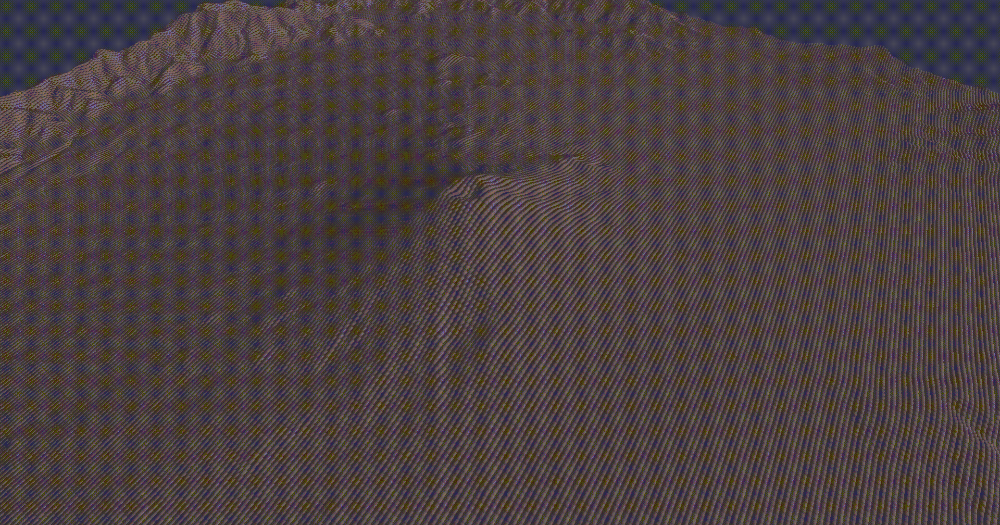

# Large Scale Lava


## Installation
Make sure your `pip` is up-to-date:

```bash
$ pip3 install pip --upgrade
```

Assume you have a Python 3 environment, to install dependencies:

```bash
$ pip3 install -r requirements.txt
```


## Execution

### Parallel MOLASSES

```bash
$ python run_simulation.py --scene_file ./data/scenes/MOLASSES/fuji_scoped.json
```



### MAGFLOW

```bash
$ python run_simulation.py --scene_file ./data/scenes/MAGFLOW/fuji_scoped.json
```

